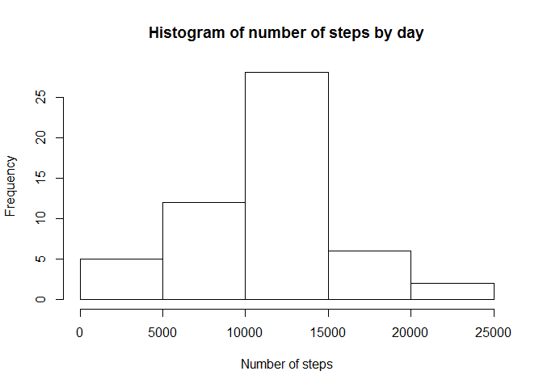
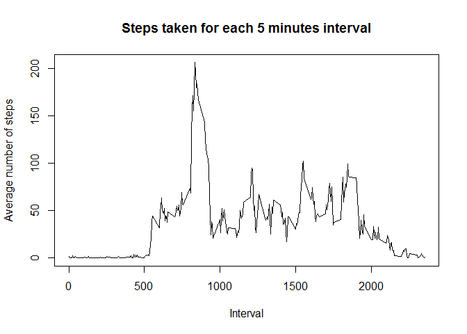
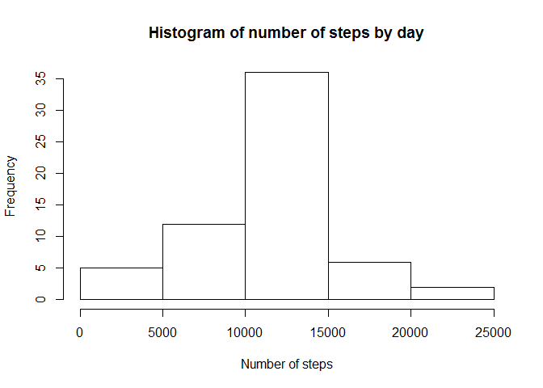
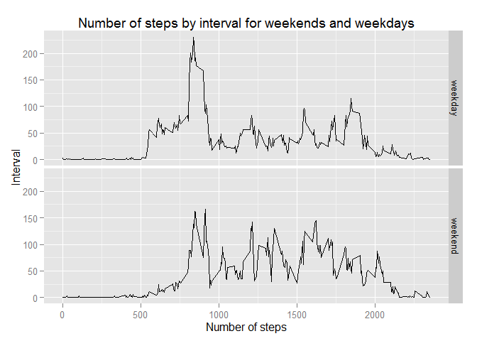

# Reproducible Research: Peer Assessment 1
## Calls the required librarys

```r
require(ggplot2)
```

```
## Loading required package: ggplot2
```

## Loading and preprocessing the data

```r
### Read the csv file
activity <- read.csv("activity.csv")
### Convert the date string to date
activity$date <- as.Date(activity$date)
### Set the location settings to english since its not my computer default language
Sys.setlocale("LC_TIME", "English")
```

```
## [1] "English_United States.1252"
```
  
## What is mean total number of steps taken per day?
1. Calculate the total number of steps taken per day

```r
aggregated_activity <- aggregate(steps ~ date, data = activity, sum)
```

2. Make a histogram of the total number of steps taken each day:  


```r
hist(x = aggregated_activity$steps, 
    main = "Histogram of number of steps by day", xlab = "Number of steps")
```

 

3. Calculate and report the mean and median of the total number of steps taken per day  

```r
steps_by_day_average <- prettyNum(mean(aggregated_activity$steps))
steps_by_day_median <- median(aggregated_activity$steps)
```

**On average 10766.19 were taken in a day, with a median of 10765 steps a day**
  
## What is the average daily activity pattern?
1. Make a time series plot (i.e. type = "l") of the 5-minute interval (x-axis) and the average number of steps taken, averaged across all days (y-axis)
* Aggregates the average number of steps by interval

```r
interval_activity <- aggregate(steps ~ interval, data = activity, mean)
```

* Displays the plot

```r
plot(interval_activity$interval, 
    interval_activity$steps, 
    type = "l", 
    main = "Steps taken for each 5 minutes interval", 
    xlab = "Interval", 
    ylab = "Average number of steps")
```

 

2. Which 5-minute interval, on average across all the days in the dataset, contains the maximum number of steps?  

```r
max_interval <- interval_activity[interval_activity$steps == max(interval_activity$steps),]
interval_range <- paste(max_interval$interval, 
                        max_interval$interval + 5,
                        sep = " to ")
interval_steps <- prettyNum(max_interval$steps)
```

**The interval which contains the maximum number of steps is 835 to 840 minutes with 206.1698 steps**

## Imputing missing values
1. Calculate and report the total number of missing values in the dataset (i.e. the total number of rows with NAs)

```r
missing_values_count <- sum(is.na(activity$steps), na.rm = FALSE)
```

2. Devise a strategy for filling in all of the missing values in the dataset. The strategy does not need to be sophisticated. For example, you could use the mean/median for that day, or the mean for that 5-minute interval, etc.


```r
interval_means <- by(activity$steps, activity$interval, mean, na.rm=TRUE)
na_index <- which(is.na(activity$steps))
na_filled_activity <- activity
na_filled_activity[na_index, "steps"] <-
        interval_means[as.character(activity[na_index,"interval"])]
```

3. Create a new dataset that is equal to the original dataset but with the missing data filled in.  
**Done in the previous step**

4. Make a histogram of the total number of steps taken each day and Calculate and report the mean and median total number of steps taken per day. 

```r
## Aggregate the data by date again, but without NA
aggregated_activity_2 <- aggregate(steps ~ date, data = na_filled_activity, sum)
hist(x = aggregated_activity_2$steps, 
    main = "Histogram of number of steps by day", xlab = "Number of steps")
```

 


Recalculates the mean with the new values

```r
steps_by_day_average_2 <- prettyNum(mean(aggregated_activity_2$steps))
steps_by_day_median_2 <- prettyNum(median(aggregated_activity_2$steps))
```

**The new mean is 10766.19 steps a day, and the median 10766.19 steps a day**

*Do these values differ from the estimates from the first part of the assignment? **As expected, these values are slightly bigger than the previous**

* What is the impact of imputing missing data on the estimates of the total daily number of steps?
**The missing data may lead us to miss some important values, decreasing the confiability of our research**

## Are there differences in activity patterns between weekdays and weekends?
1. Create a new factor variable in the dataset with two levels - "weekday" and "weekend" indicating whether a given date is a weekday or weekend day.

* Get the weekdays

```r
wDays <- weekdays(as.Date(na_filled_activity$date))
```

* Define which days are weekend and which are not

```r
weekend <- wDays=="Saturday" | wDays=="Sunday"
wDays[weekend] <- "weekend"
wDays[!weekend] <- "weekday"
```

* Set the weekend factor

```r
na_filled_activity$weekend <- factor(wDays)
```


2. Make a panel plot containing a time series plot (i.e. type = "l") of the 5-minute interval (x-axis) and the average number of steps taken, averaged across all weekday days or weekend days (y-axis). See the README file in the GitHub repository to see an example of what this plot should look like using simulated data.

* Aggregates the data by weekend and interval

```r
day_interval_mean <- aggregate(steps ~ weekend + interval, 
                               data = na_filled_activity, 
                               mean)
```

* Uses qplot to plot a line plot by weekend and weekday

```r
qplot(data = day_interval_mean, x = interval, y = steps, facets = weekend ~ ., geom = "line", main = "Number of steps by interval for weekends and weekdays", xlab = "Number of steps", ylab = "Interval")
```

 
